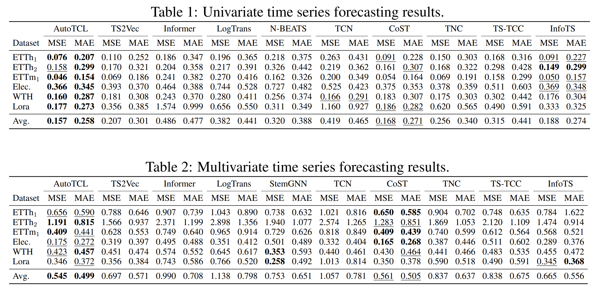
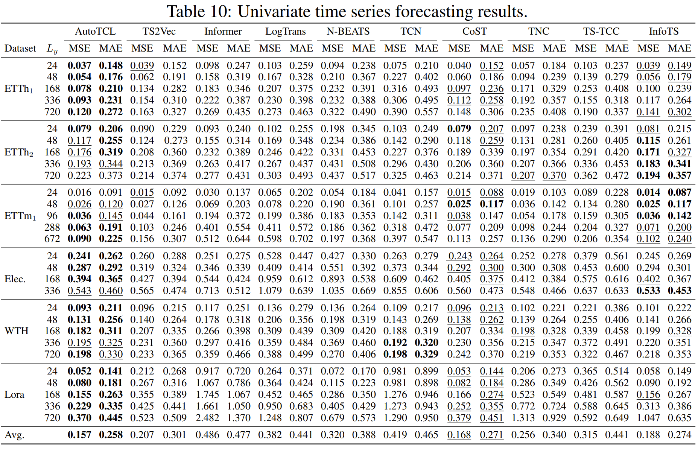
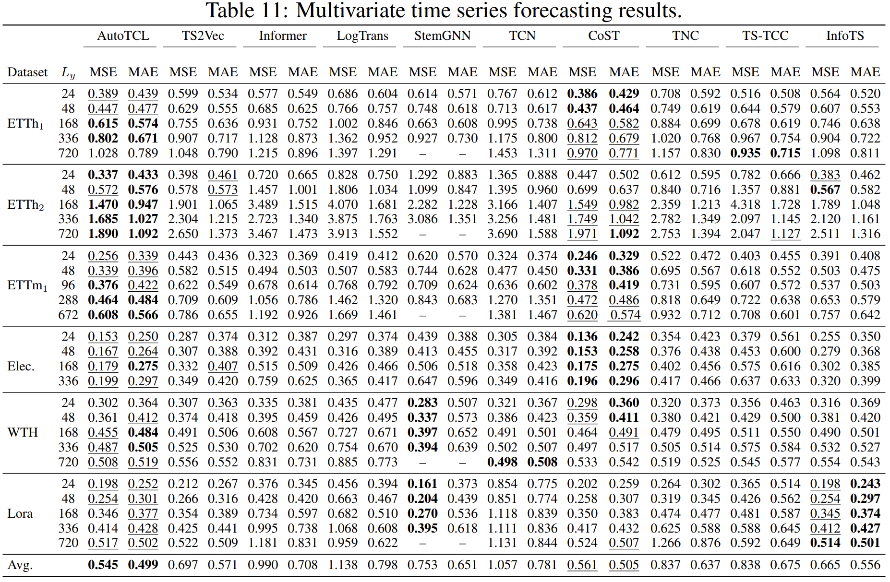

# This code is for the work of [AutoTCL](https://github.com/AI4TS/AI4TS.github.io/blob/main/CameraReadys%201-22%202/19%5CAI4TSAutoTCL%20(3).pdf) and [Parametric Augmentation for Time Series Contrastive Learning(ICLR2024)](https://openreview.net/forum?id=EIPLdFy3vp)
<p align="center">

<br><br>
<b>Figure 1.</b> Overall framework of our work.
</p>

In this paper, we propose [a contrastive learning framework]() with parametric augmentation, AutoTCL, 
which can be adaptively employed to support time series representation learning. 
The proposed approach is [encoder-agnostic](), allowing it to be seamlessly integrated with different backbone
encoders.

## It is an early version, the final version will be coming soon.


## Requirements
We use python 3.9.16, the packages main contain numpy, scikit-learn, torch, tqdm, matplotlib, pandas. We also provide a 
requirements.txt(contains some other irrelevant packages).

## dataset
1. ETT dataset [(link)](https://github.com/zhouhaoyi/ETDataset)
2. Electricity dataset [(link)](https://archive.ics.uci.edu/dataset/321/electricityloaddiagrams20112014), preprocessing by this file [(link)](https://github.com/zhihanyue/ts2vec/blob/main/datasets/preprocess_electricity.py)
3. Weather Dataset [(link)](https://drive.google.com/drive/folders/1ohGYWWohJlOlb2gsGTeEq3Wii2egnEPR), from Informer [(link)](https://github.com/zhouhaoyi/Informer2020)
4. For public datasets, you can also find sources in [TS2Vec](https://github.com/yuezhihan/ts2vec), [CoST](https://github.com/salesforce/CoST).
5. For lora datasets, you can contact with [Professor Mo Sha](https://users.cs.fiu.edu/~msha/).

## usage
```commandline
python train_forecasting_autotcl_cost.py 
--dataset <dataset> 
--gpu <num> 
--seed <random_seed> 
--archive <forecast_csv_univar/forecast_csv>
--load_default <True/False> 

--batch-size <N> 
--lr <encoder_learning_rate> 
--meta_lr <augument_learning_rate>
--mask_mode <noise_style_encoder> 
--augmask_mode <noise_style_augument> 

--repr_dims <embedding_dim>
--hidden_dims <hid_dim> 
--depth <encoder_layers> 
--aug_depth <augument_layers> 

--max_train_length <input_time_length> 
--epochs <training_epoch> 
--gumbel_bias <gum_bias>
--ratio_step <ratio_update_between_encoder_augument> 
--hard_mask <hard_gumbel>
--gamma_zeta <zeta_in_gumbel>

--local_weight <local_infonce_encoder>
--reg_weight <reg_weight_hx>
--regular_weight <time_constraint_weight_hx>
```
| args    | explanation                                    | type   |
|---------|------------------------------------------------|--------|
| dataset | dataset name                                   | string |
|   gpu   | the number of GPU                              | int    |
|   seed  | random seed                                    | int    |
|   archive   | univar forecasting or multivar                 | string |
|   load_default   | load pre-defined hyperparemeters               | bool   |
|   batch-size   | the batch size of input                        | int    |
|   lr   | learning rate for optimize the encoder network | float  | 


## Main Results
Our experiments conducted on five public datasets and one private dataset. Experiments on univariate forecasting tasks demonstrate the highly
competitive results of our method, with an average 6.5% reduction in MSE and 4.7% in MAE over the leading baselines. In classification tasks, AutoTCL achieves
a 1.2% increase in average accuracy.

In this repo we provide code and default parameters to reproduce our experiments(based on tabl 1 and 2).

<p align="center">

<br><br>
<b>Figure 2.</b> Overall experiments average results.
</p>


<p align="center">

<br><br>
<b>Figure 3.</b> Detail experiments results in univariate forecasting setting.
</p>

<p align="center">

<br><br>
<b>Figure 4.</b> Detail experiments results in multivariate forecasting setting.
</p>

## Acknowledgement
Our code are based on the following repositories. We thank the original authors for open-sourcing their work.
1. TS2Vec(https://github.com/zhihanyue/ts2vec)
2. CoST(https://github.com/salesforce/CoST)
3. infoTS(https://github.com/chengw07/InfoTS)


## Citation

If this repo is useful for you, please consider citing our paper as follows:

```
@article{zheng2024parametric,
  title={Parametric Augmentation for Time Series Contrastive Learning},
  author={Zheng, Xu and Wang, Tianchun and Cheng, Wei and Ma, Aitian and Chen, Haifeng and Sha, Mo and Luo, Dongsheng},
  journal={arXiv preprint arXiv:2402.10434},
  year={2024}
}
```

