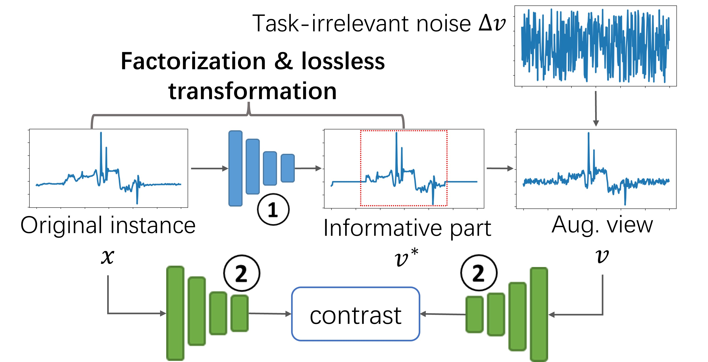

# This code is for the work of [AutoTCL](https://github.com/AI4TS/AI4TS.github.io/blob/main/CameraReadys%201-22%202/19%5CAI4TSAutoTCL%20(3).pdf) and [Parametric Augmentation for Time Series Contrastive Learning](https://openreview.net/forum?id=EIPLdFy3vp)
<p align="center">

<br><br>
<b>Figure 1.</b> Overall framework of our work.
</p>

## Requirements
numpy, scikit-learn, torch, tqdm, matplotlib, pandas

## dataset
For public datasets, you can find sources in [TS2Vec](https://github.com/yuezhihan/ts2vec), [CoST](https://github.com/salesforce/CoST).
For lora datasets, you can contact with [Professor Mo Sha](https://users.cs.fiu.edu/~msha/).

## usage
```commandline
python train_forecasting_autotcl_cost.py 
```
## It is an early version, the final version will be coming soon.
