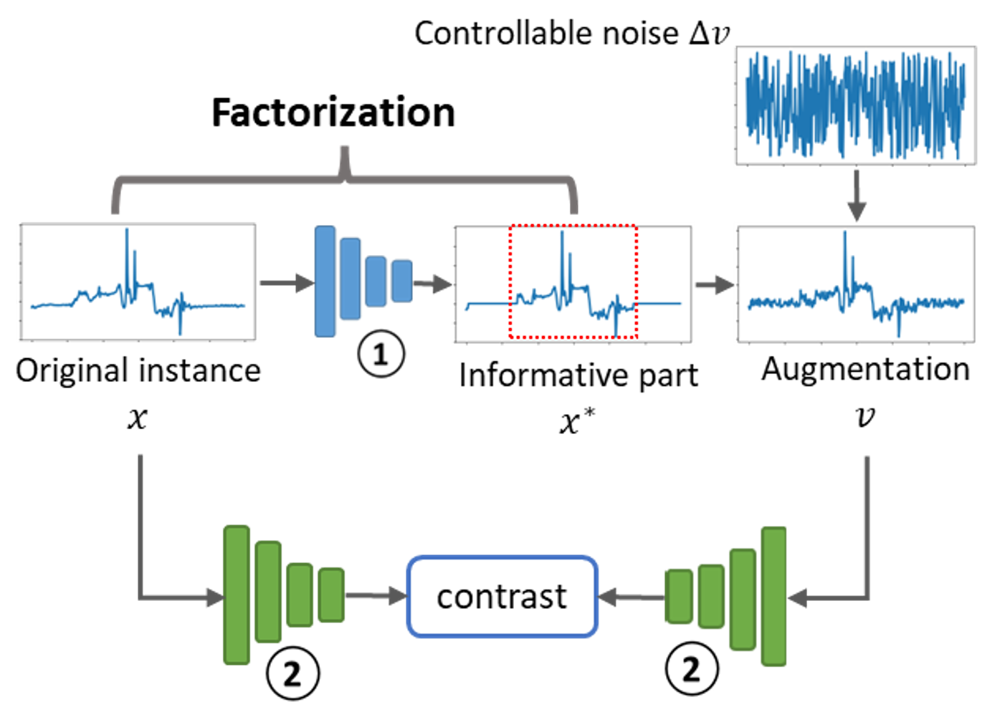

# This code is for the work of AutoTCL 
<p align="center">

<br><br>
<b>Figure 1.</b> Overall framework of our work.
</p>

## Requirements
numpy, scikit-learn, torch, tqdm, matplotlib, pandas

## dataset
For public datasets, you can find sources in [TS2Vec](https://github.com/yuezhihan/ts2vec), [CoST](https://github.com/salesforce/CoST).
For lora datasets, you can contact with [Professor Mo Sha](https://users.cs.fiu.edu/~msha/).

## usage
```commandline
python get_lora_embedding.py --dataset 20221112-lora-features \
                             --mask_mode mask_last \
                             --time_cols gw1-lp-PRR1,gw2-lp-PRR1,gw2-lp-PRR2,gw1-lp-BER1,gw1-lp-BER2,gw2-lp-BER1,gw1-lp-RSSI2 \
                             --forecast_cols WS-temper,WS-humidity,WS-wind-speed \
                             --lr 0.001  \
                             --meta_lr 0.1 \
                             --reg_weight 0.001 
```
